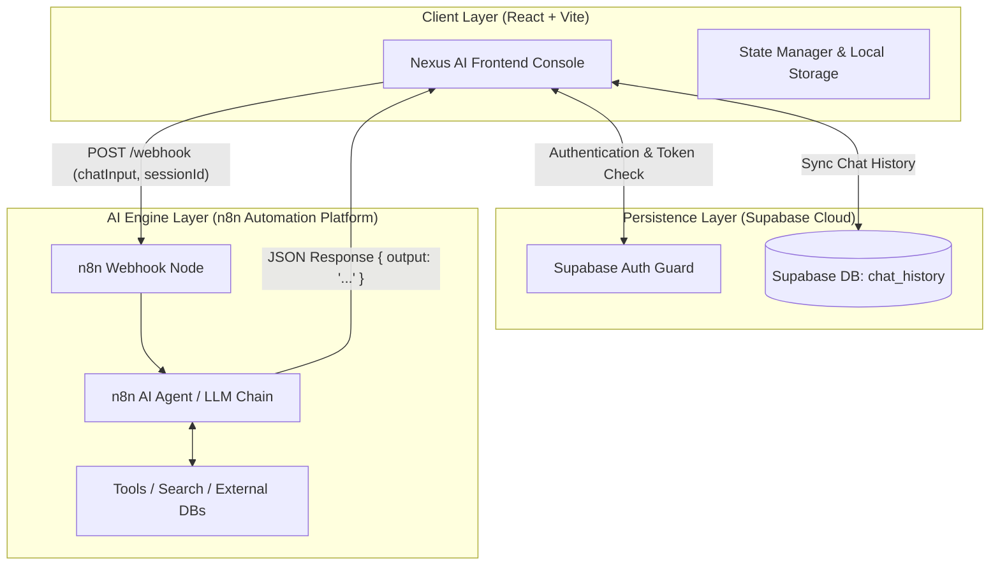

<div align="center">

# ⚡ Nexus AI — Next-Gen AI Workspace & n8n Workflow Intelligence

**A sleek, high-performance, dark-themed AI chat workspace built with React 19, Vite, TypeScript, Tailwind CSS v4, Supabase, and n8n AI Agent Workflows.**

[](https://react.dev/)
[](https://vitejs.dev/)
[](https://www.typescriptlang.org/)
[](https://tailwindcss.com/)
[](https://supabase.com/)
[](https://n8n.io/)
[](LICENSE)

</div>

---

## 📌 Table of Contents

- [Overview](#-overview)
- [✨ Key Features](#-key-features)
- [🏗️ System Architecture & Workflow](#️-system-architecture--workflow)
- [🛠️ Tech Stack](#️-tech-stack)
- [🗄️ Database Setup (Supabase)](#️-database-setup-supabase)
- [🔌 n8n Workflow Integration](#-n8n-workflow-integration)
- [🚀 Quick Start & Installation](#-quick-start--installation)
- [⚙️ Environment Variables](#️-environment-variables)
- [📦 Production Build & Deployment](#-production-build--deployment)
- [🤝 Contributing & License](#-contributing--license)

---

## 📖 Overview

**Nexus AI** is a production-ready, full-stack AI workspace interface designed to bridge frontend interaction with backend workflow automation. Rather than relying on simple API wrappers, Nexus AI is built to operate as an intelligent front-end console that orchestrates real-time interactions with custom **n8n AI Agents**, **OpenAI**, **Google Gemini**, or custom webhook endpoints.

Equipped with a glassmorphic aesthetic, multi-session management, Supabase cloud sync, and guest-mode capabilities, Nexus AI delivers an experience comparable to commercial platforms like ChatGPT and Claude—tailored for developers and teams integrating custom AI workflows.

---

## ✨ Key Features

### 🔌 n8n AI Agent Workflow Integration
- Direct communication with **n8n Webhook endpoints** for custom AI agent orchestration.
- Support for complex agentic workflows including web searching, database retrieval, multi-model fallback, and tool execution.

### 🔐 Dual-Mode Authentication & Authorization
- **Supabase Authentication:** Full Email/Password registration and login with secure JWT session handling.
- **Instant Guest Mode:** Zero-friction access allowing users to start chatting immediately, with sessions cached locally.

### 💾 Persistent Multi-Session History
- Real-time cloud storage sync mapping user sessions to Supabase `chat_history`.
- Instant session switching, session title auto-generation, search filtering, and history deletion.

### 🎨 Modern Glassmorphic Design System
- Dark mode theme with ambient radial background glows and micro-animations built with **Framer Motion**.
- Custom multi-layered animated glowing logo, typing indicators, and celebration confetti effects.

### 📝 Markdown & Code Rendering
- Powered by `react-markdown` and `@tailwindcss/typography`.
- Renders rich text formatting, lists, tables, and code snippets with inline highlights and formatting.

### 📱 Responsive & Adaptive Layout
- Fluid drawer sidebar and dynamic viewports optimized across desktop, tablet, and mobile devices.

---

## 🏗️ System Architecture & Workflow

Nexus AI follows a modular architecture separating presentation, session state, persistence, and AI reasoning:



1. **User Interaction:** The user submits a prompt in the Nexus AI input bar.
2. **Local & Cloud Persistence:** The user prompt is immediately saved to state and sent to Supabase `chat_history`.
3. **Webhook Dispatch:** The message payload `{ chatInput, sessionId }` is dispatched via HTTP POST to the configured `VITE_N8N_WEBHOOK_URL`.
4. **n8n Workflow Execution:** n8n processes the input through AI agents (e.g. Gemini, OpenAI, Vector DBs, or Web Search tools).
5. **AI Response Delivery:** n8n returns a JSON response containing the synthesized output, which is formatted and rendered in real time.

---

## 🛠️ Tech Stack

| Domain | Technology / Library | Purpose |
| :--- | :--- | :--- |
| **Frontend Framework** | `React 19` | UI component architecture and state rendering |
| **Build Tooling** | `Vite 8` | High-speed ESM dev server and production bundling |
| **Language** | `TypeScript 5` | Static type safety and structured interfaces |
| **Styling** | `Tailwind CSS v4` | Modern utility-first styling and custom design tokens |
| **Animations** | `Framer Motion 12` | Fluid drawer transitions, modal popups, and micro-interactions |
| **Visual FX** | `canvas-confetti` | Interactive celebration animations on new sessions |
| **Icons** | `Lucide React` | Clean vector iconography |
| **Authentication & DB** | `@supabase/supabase-js` | User authentication & real-time Postgres database sync |
| **Markdown Parser** | `react-markdown` | Markdown parsing for bold text, lists, and code blocks |
| **Workflow Automation** | `n8n` | Backend webhook processing & LLM agent orchestration |

---

## 🗄️ Database Setup (Supabase)

To enable cloud message persistence, set up a table named `chat_history` in your Supabase SQL Editor:

```sql
-- 1. Create chat_history table
CREATE TABLE IF NOT EXISTS public.chat_history (
    id UUID PRIMARY KEY DEFAULT gen_random_uuid(),
    user_id UUID NOT NULL REFERENCES auth.users(id) ON DELETE CASCADE,
    message TEXT NOT NULL,
    sender TEXT NOT NULL CHECK (sender IN ('user', 'bot', 'human')),
    created_at TIMESTAMP WITH TIME ZONE DEFAULT NOW()
);

-- 2. Enable Row Level Security (RLS)
ALTER TABLE public.chat_history ENABLE ROW LEVEL SECURITY;

-- 3. Create RLS Policy for Users to Access Only Their Own History
CREATE POLICY "Users can manage their own chat history"
ON public.chat_history
FOR ALL
USING (auth.uid() = user_id)
WITH CHECK (auth.uid() = user_id);
```

---

## 🔌 n8n Workflow Integration

Nexus AI sends payload requests to n8n in the following standard JSON format:

```json
{
  "chatInput": "Explain quantum computing in simple terms.",
  "sessionId": "a1b2c3d4-e5f6-7890-abcd-1234567890ab"
}
```

### Expected n8n Response Structure:
Your n8n webhook workflow node should return a JSON object with any of the following fields:

```json
{
  "output": "Quantum computing is a rapidly-emerging technology that harnesses the laws of quantum mechanics to solve complex problems..."
}
```
*(Nexus AI automatically handles `output`, `text`, `message`, `response`, or `result` fields).*

---

## 🚀 Quick Start & Installation

### Prerequisites
- **Node.js:** v18.x or higher
- **npm:** v9.x or higher
- *(Optional)* **Supabase Account & n8n Instance** for full database & AI features.

### Step-by-Step Setup

1. **Clone the Repository:**
   ```bash
   git clone https://github.com/Mohsin-Ali-Rana/ChatBot.git
   cd ChatBot
   ```

2. **Install Dependencies:**
   ```bash
   npm install
   ```

3. **Configure Environment Variables:**
   Create a `.env` file in the root directory (refer to `.env.example`):
   ```bash
   cp .env.example .env
   ```

4. **Run the Development Server:**
   ```bash
   npm run dev
   ```
   Open `http://localhost:5173` in your browser.

---

## ⚙️ Environment Variables

Configure the following variables in your `.env` file:

```env
# Supabase Configuration (Cloud DB & Authentication)
VITE_SUPABASE_URL=https://your-supabase-project-id.supabase.co
VITE_SUPABASE_ANON_KEY=your-supabase-anon-key-here

# n8n AI Agent Webhook Endpoint
VITE_N8N_WEBHOOK_URL=https://your-n8n-instance.com/webhook/your-webhook-id
```

> [!NOTE]
> If Supabase variables are omitted, Nexus AI gracefully falls back to local storage session management.

---

## 📦 Production Build & Deployment

### Build for Production
Generate an optimized production build in the `dist` directory:

```bash
npm run build
```

### Preview Locally
Test the production build locally:

```bash
npm run preview
```

### Deploy to Vercel / Netlify
1. Connect your GitHub repository to **Vercel** or **Netlify**.
2. In the dashboard settings, add your Environment Variables (`VITE_SUPABASE_URL`, `VITE_SUPABASE_ANON_KEY`, `VITE_N8N_WEBHOOK_URL`).
3. Click **Deploy**.

---

## 🤝 Contributing & License

Contributions, issues, and feature requests are welcome! Feel free to check the [issues page](https://github.com/Mohsin-Ali-Rana/ChatBot/issues).

Distributed under the **MIT License**. See `LICENSE` for more information.

---

<div align="center">
  <sub>Built with ❤️ using React 19, Tailwind CSS v4, Supabase, and n8n.</sub>
</div>
